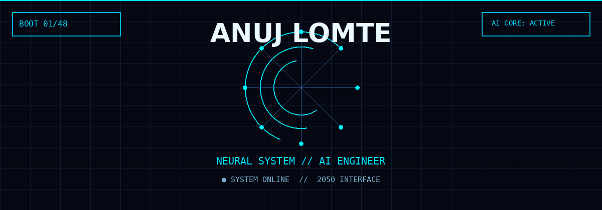
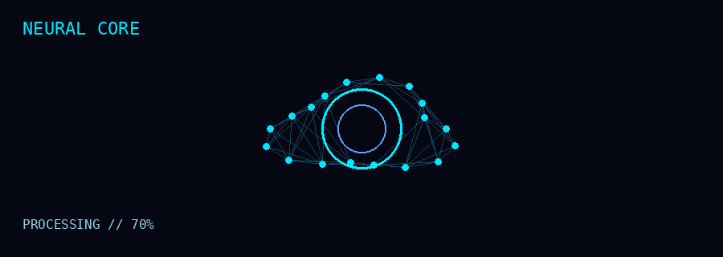

<!-- ANUJ LOMTE // 2050 INTERFACE -->

<div align="center">



<br>


<br><br>


&nbsp;

&nbsp;


</div>

---

<div align="center">

# `// DIGITAL IDENTITY`

```text
╔══════════════════════════════════════════════════════════════╗
║                    ANUJ LOMTE // 2050                       ║
╠══════════════════════════════════════════════════════════════╣
║  ROLE       :: AI ENGINEER / FULL STACK BUILDER             ║
║  CORE       :: AI • ML • GENERATIVE AI • AGENTS             ║
║  FOCUS      :: INTELLIGENT SYSTEMS + REAL PRODUCTS          ║
║  EDUCATION  :: B.Tech CSE — Data Science [2024 → 2028]      ║
║  LOCATION   :: HYDERABAD, INDIA                             ║
║  STATUS     :: ● ONLINE                                     ║
╚══════════════════════════════════════════════════════════════╝
```

> **I build intelligent systems where AI, data and software engineering meet.**

</div>

---

## `01 // NEURAL CORE`

<div align="center">



</div>

```text
AI / MACHINE LEARNING     ███████████████████░  CORE
GENERATIVE AI             ██████████████████░░  CORE
AI AGENTS                 █████████████████░░░  BUILDING
COMPUTER VISION           ████████████████░░░░  BUILDING
FULL STACK                █████████████████░░░  CORE
DATA SCIENCE              ███████████████░░░░░  CORE
```

---

## `02 // CURRENT MISSION`

```diff
+ BUILD intelligent AI systems
+ EXPERIMENT with agentic workflows
+ TRAIN and deploy ML models
+ CREATE full-stack products
+ TURN ideas into usable software
- CHASE every framework that exists
```

### `ACTIVE RESEARCH`

`Generative AI` · `AI Agents` · `Machine Learning` · `Computer Vision` · `RAG` · `Automation`

---

## `03 // TECHNOLOGY MATRIX`

### AI / ML

<p align="center">

</p>

### FULL STACK

<p align="center">

</p>

### DATA / INFRA

<p align="center">

</p>

### AI ECOSYSTEM

<div align="center">

`OpenAI` · `LangChain` · `Hugging Face` · `RAG` · `AI Agents`

</div>

---

## `04 // SYSTEM ARCHITECTURE`

```text
                  ┌──────────────────┐
                  │      HUMAN       │
                  └────────┬─────────┘
                           │
                           ▼
                  ┌──────────────────┐
                  │      IDEA        │
                  └────────┬─────────┘
                           │
             ┌─────────────┴─────────────┐
             ▼                           ▼
      ┌──────────────┐           ┌──────────────┐
      │   AI / ML    │           │  FULL STACK  │
      └──────┬───────┘           └──────┬───────┘
             │                          │
             └─────────────┬────────────┘
                           ▼
                  ┌──────────────────┐
                  │  INTELLIGENT     │
                  │     PRODUCT      │
                  └────────┬─────────┘
                           │
                           ▼
                  ┌──────────────────┐
                  │   REAL WORLD     │
                  └──────────────────┘
```

---

## `05 // PROJECT SYSTEMS`

> **Projects are the proof.** The showcase below is intentionally kept clean so each project can later have its own GIF/demo.

```text
╔══════════════════════════════════════════════════════════════╗
║ PROJECT_001 // INTELLIGENT SYSTEM                            ║
║                                                              ║
║ AI / MACHINE LEARNING                                       ║
║ Build → Train → Evaluate → Deploy                            ║
║                                                              ║
║ [ ADD PROJECT GIF ]   [ SOURCE CODE ]                        ║
╚══════════════════════════════════════════════════════════════╝
```

```text
╔══════════════════════════════════════════════════════════════╗
║ PROJECT_002 // AGENTIC SYSTEM                                ║
║                                                              ║
║ THINK → PLAN → USE TOOLS → ACT → REMEMBER                    ║
║                                                              ║
║ [ ADD PROJECT GIF ]   [ SOURCE CODE ]                        ║
╚══════════════════════════════════════════════════════════════╝
```

---

## `06 // GITHUB TELEMETRY`

<div align="center">


<br><br>


</div>

---

## `07 // CONTRIBUTION STREAM`

<div align="center">


<br><br>


</div>

---

## `08 // ACHIEVEMENT PROTOCOL`

<div align="center">


</div>

---

## `09 // CONNECT TO SYSTEM`

<div align="center">

<a href="https://github.com/anuj16920">

</a>

<a href="https://www.linkedin.com/">

</a>

<a href="mailto:yourmail@gmail.com">

</a>

</div>

<br>

<div align="center">

```text
╔══════════════════════════════════════════════════════════╗
║                                                          ║
║        THE FUTURE IS BUILT, NOT PREDICTED.              ║
║                                                          ║
║              ANUJ // SYSTEM ONLINE                      ║
║                                                          ║
╚══════════════════════════════════════════════════════════╝
```

</div>

<!-- END OF INTERFACE -->
<!-- Agent update 1 on Mon Sep 14 17:38:20 UTC 2026 -->
<!-- Agent update 2 on Mon Sep 14 17:38:21 UTC 2026 -->
<!-- Agent update 3 on Mon Sep 14 17:38:26 UTC 2026 -->
<!-- Agent update 4 on Mon Sep 14 17:38:27 UTC 2026 -->
<!-- Agent update 5 on Mon Sep 14 17:38:32 UTC 2026 -->
<!-- Agent update 6 on Mon Sep 14 17:38:34 UTC 2026 -->
<!-- Agent update 7 on Mon Sep 14 17:38:37 UTC 2026 -->
<!-- Agent update 8 on Mon Sep 14 17:38:41 UTC 2026 -->
<!-- Agent update 9 on Mon Sep 14 17:38:46 UTC 2026 -->
<!-- Agent update 10 on Mon Sep 14 17:38:51 UTC 2026 -->
<!-- Agent update 11 on Mon Sep 14 17:38:54 UTC 2026 -->
<!-- Agent update 12 on Mon Sep 14 17:38:59 UTC 2026 -->
<!-- Agent update 13 on Mon Sep 14 17:39:05 UTC 2026 -->
<!-- Agent update 14 on Mon Sep 14 17:39:08 UTC 2026 -->
<!-- Agent update 15 on Mon Sep 14 17:39:10 UTC 2026 -->
<!-- Agent update 1 on Tue Sep 15 16:12:02 UTC 2026 -->
<!-- Agent update 2 on Tue Sep 15 16:12:03 UTC 2026 -->
<!-- Agent update 3 on Tue Sep 15 16:12:04 UTC 2026 -->
<!-- Agent update 4 on Tue Sep 15 16:12:09 UTC 2026 -->
<!-- Agent update 5 on Tue Sep 15 16:12:13 UTC 2026 -->
<!-- Agent update 6 on Tue Sep 15 16:12:15 UTC 2026 -->
<!-- Agent update 7 on Tue Sep 15 16:12:16 UTC 2026 -->
<!-- Agent update 8 on Tue Sep 15 16:12:20 UTC 2026 -->
<!-- Agent update 9 on Tue Sep 15 16:12:21 UTC 2026 -->
<!-- Agent update 10 on Tue Sep 15 16:12:26 UTC 2026 -->
<!-- Agent update 11 on Tue Sep 15 16:12:28 UTC 2026 -->
<!-- Agent update 12 on Tue Sep 15 16:12:31 UTC 2026 -->
<!-- Agent update 13 on Tue Sep 15 16:12:36 UTC 2026 -->
<!-- Agent update 14 on Tue Sep 15 16:12:38 UTC 2026 -->
<!-- Agent update 15 on Tue Sep 15 16:12:39 UTC 2026 -->
<!-- Agent update 1 on Wed Sep 16 16:05:08 UTC 2026 -->
<!-- Agent update 2 on Wed Sep 16 16:05:09 UTC 2026 -->
<!-- Agent update 3 on Wed Sep 16 16:05:10 UTC 2026 -->
<!-- Agent update 4 on Wed Sep 16 16:05:12 UTC 2026 -->
<!-- Agent update 5 on Wed Sep 16 16:05:16 UTC 2026 -->
<!-- Agent update 6 on Wed Sep 16 16:05:17 UTC 2026 -->
<!-- Agent update 7 on Wed Sep 16 16:05:18 UTC 2026 -->
<!-- Agent update 8 on Wed Sep 16 16:05:21 UTC 2026 -->
<!-- Agent update 9 on Wed Sep 16 16:05:23 UTC 2026 -->
<!-- Agent update 10 on Wed Sep 16 16:05:24 UTC 2026 -->
<!-- Agent update 11 on Wed Sep 16 16:05:27 UTC 2026 -->
<!-- Agent update 12 on Wed Sep 16 16:05:29 UTC 2026 -->
<!-- Agent update 13 on Wed Sep 16 16:05:34 UTC 2026 -->
<!-- Agent update 14 on Wed Sep 16 16:05:37 UTC 2026 -->
<!-- Agent update 15 on Wed Sep 16 16:05:40 UTC 2026 -->
<!-- Agent update 1 on Thu Sep 17 16:12:03 UTC 2026 -->
<!-- Agent update 2 on Thu Sep 17 16:12:08 UTC 2026 -->
<!-- Agent update 3 on Thu Sep 17 16:12:11 UTC 2026 -->
<!-- Agent update 4 on Thu Sep 17 16:12:14 UTC 2026 -->
<!-- Agent update 5 on Thu Sep 17 16:12:17 UTC 2026 -->
<!-- Agent update 6 on Thu Sep 17 16:12:20 UTC 2026 -->
<!-- Agent update 7 on Thu Sep 17 16:12:22 UTC 2026 -->
<!-- Agent update 8 on Thu Sep 17 16:12:24 UTC 2026 -->
<!-- Agent update 9 on Thu Sep 17 16:12:26 UTC 2026 -->
<!-- Agent update 10 on Thu Sep 17 16:12:29 UTC 2026 -->
<!-- Agent update 11 on Thu Sep 17 16:12:33 UTC 2026 -->
<!-- Agent update 12 on Thu Sep 17 16:12:37 UTC 2026 -->
<!-- Agent update 13 on Thu Sep 17 16:12:38 UTC 2026 -->
<!-- Agent update 14 on Thu Sep 17 16:12:39 UTC 2026 -->
<!-- Agent update 15 on Thu Sep 17 16:12:41 UTC 2026 -->
<!-- Agent update 1 on Fri Sep 18 15:47:10 UTC 2026 -->
<!-- Agent update 2 on Fri Sep 18 15:47:14 UTC 2026 -->
<!-- Agent update 3 on Fri Sep 18 15:47:16 UTC 2026 -->
<!-- Agent update 4 on Fri Sep 18 15:47:17 UTC 2026 -->
<!-- Agent update 5 on Fri Sep 18 15:47:18 UTC 2026 -->
<!-- Agent update 6 on Fri Sep 18 15:47:21 UTC 2026 -->
<!-- Agent update 7 on Fri Sep 18 15:47:25 UTC 2026 -->
<!-- Agent update 8 on Fri Sep 18 15:47:28 UTC 2026 -->
<!-- Agent update 9 on Fri Sep 18 15:47:33 UTC 2026 -->
<!-- Agent update 10 on Fri Sep 18 15:47:34 UTC 2026 -->
<!-- Agent update 11 on Fri Sep 18 15:47:37 UTC 2026 -->
<!-- Agent update 12 on Fri Sep 18 15:47:40 UTC 2026 -->
<!-- Agent update 13 on Fri Sep 18 15:47:42 UTC 2026 -->
<!-- Agent update 14 on Fri Sep 18 15:47:47 UTC 2026 -->
<!-- Agent update 15 on Fri Sep 18 15:47:49 UTC 2026 -->
<!-- Agent update 1 on Sat Sep 19 15:19:36 UTC 2026 -->
<!-- Agent update 2 on Sat Sep 19 15:19:41 UTC 2026 -->
<!-- Agent update 3 on Sat Sep 19 15:19:45 UTC 2026 -->
<!-- Agent update 4 on Sat Sep 19 15:19:46 UTC 2026 -->
<!-- Agent update 5 on Sat Sep 19 15:19:50 UTC 2026 -->
<!-- Agent update 6 on Sat Sep 19 15:19:52 UTC 2026 -->
<!-- Agent update 7 on Sat Sep 19 15:19:57 UTC 2026 -->
<!-- Agent update 8 on Sat Sep 19 15:19:58 UTC 2026 -->
<!-- Agent update 9 on Sat Sep 19 15:19:59 UTC 2026 -->
<!-- Agent update 10 on Sat Sep 19 15:20:02 UTC 2026 -->
<!-- Agent update 11 on Sat Sep 19 15:20:05 UTC 2026 -->
<!-- Agent update 12 on Sat Sep 19 15:20:07 UTC 2026 -->
<!-- Agent update 13 on Sat Sep 19 15:20:08 UTC 2026 -->
<!-- Agent update 14 on Sat Sep 19 15:20:13 UTC 2026 -->
<!-- Agent update 15 on Sat Sep 19 15:20:16 UTC 2026 -->
<!-- Agent update 1 on Sun Sep 20 15:23:59 UTC 2026 -->
<!-- Agent update 2 on Sun Sep 20 15:24:02 UTC 2026 -->
<!-- Agent update 3 on Sun Sep 20 15:24:03 UTC 2026 -->
<!-- Agent update 4 on Sun Sep 20 15:24:06 UTC 2026 -->
<!-- Agent update 5 on Sun Sep 20 15:24:08 UTC 2026 -->
<!-- Agent update 6 on Sun Sep 20 15:24:12 UTC 2026 -->
<!-- Agent update 7 on Sun Sep 20 15:24:14 UTC 2026 -->
<!-- Agent update 8 on Sun Sep 20 15:24:19 UTC 2026 -->
<!-- Agent update 9 on Sun Sep 20 15:24:23 UTC 2026 -->
<!-- Agent update 10 on Sun Sep 20 15:24:26 UTC 2026 -->
<!-- Agent update 11 on Sun Sep 20 15:24:31 UTC 2026 -->
<!-- Agent update 12 on Sun Sep 20 15:24:33 UTC 2026 -->
<!-- Agent update 13 on Sun Sep 20 15:24:37 UTC 2026 -->
<!-- Agent update 14 on Sun Sep 20 15:24:42 UTC 2026 -->
<!-- Agent update 15 on Sun Sep 20 15:24:47 UTC 2026 -->
<!-- Agent update 1 on Mon Sep 21 17:50:29 UTC 2026 -->
<!-- Agent update 2 on Mon Sep 21 17:50:33 UTC 2026 -->
<!-- Agent update 3 on Mon Sep 21 17:50:36 UTC 2026 -->
<!-- Agent update 4 on Mon Sep 21 17:50:37 UTC 2026 -->
<!-- Agent update 5 on Mon Sep 21 17:50:39 UTC 2026 -->
<!-- Agent update 6 on Mon Sep 21 17:50:44 UTC 2026 -->
<!-- Agent update 7 on Mon Sep 21 17:50:45 UTC 2026 -->
<!-- Agent update 8 on Mon Sep 21 17:50:47 UTC 2026 -->
<!-- Agent update 9 on Mon Sep 21 17:50:52 UTC 2026 -->
<!-- Agent update 10 on Mon Sep 21 17:50:56 UTC 2026 -->
<!-- Agent update 11 on Mon Sep 21 17:50:59 UTC 2026 -->
<!-- Agent update 12 on Mon Sep 21 17:51:02 UTC 2026 -->
<!-- Agent update 13 on Mon Sep 21 17:51:06 UTC 2026 -->
<!-- Agent update 14 on Mon Sep 21 17:51:08 UTC 2026 -->
<!-- Agent update 15 on Mon Sep 21 17:51:11 UTC 2026 -->
<!-- Agent update 1 on Tue Sep 22 16:14:06 UTC 2026 -->
<!-- Agent update 2 on Tue Sep 22 16:14:10 UTC 2026 -->
<!-- Agent update 3 on Tue Sep 22 16:14:15 UTC 2026 -->
<!-- Agent update 4 on Tue Sep 22 16:14:17 UTC 2026 -->
<!-- Agent update 5 on Tue Sep 22 16:14:20 UTC 2026 -->
<!-- Agent update 6 on Tue Sep 22 16:14:22 UTC 2026 -->
<!-- Agent update 7 on Tue Sep 22 16:14:23 UTC 2026 -->
<!-- Agent update 8 on Tue Sep 22 16:14:28 UTC 2026 -->
<!-- Agent update 9 on Tue Sep 22 16:14:29 UTC 2026 -->
<!-- Agent update 10 on Tue Sep 22 16:14:34 UTC 2026 -->
<!-- Agent update 11 on Tue Sep 22 16:14:39 UTC 2026 -->
<!-- Agent update 12 on Tue Sep 22 16:14:41 UTC 2026 -->
<!-- Agent update 13 on Tue Sep 22 16:14:46 UTC 2026 -->
<!-- Agent update 14 on Tue Sep 22 16:14:50 UTC 2026 -->
<!-- Agent update 15 on Tue Sep 22 16:14:52 UTC 2026 -->
<!-- Agent update 1 on Wed Sep 23 16:03:27 UTC 2026 -->
<!-- Agent update 2 on Wed Sep 23 16:03:31 UTC 2026 -->
<!-- Agent update 3 on Wed Sep 23 16:03:36 UTC 2026 -->
<!-- Agent update 4 on Wed Sep 23 16:03:38 UTC 2026 -->
<!-- Agent update 5 on Wed Sep 23 16:03:43 UTC 2026 -->
<!-- Agent update 6 on Wed Sep 23 16:03:46 UTC 2026 -->
<!-- Agent update 7 on Wed Sep 23 16:03:47 UTC 2026 -->
<!-- Agent update 8 on Wed Sep 23 16:03:51 UTC 2026 -->
<!-- Agent update 9 on Wed Sep 23 16:03:53 UTC 2026 -->
<!-- Agent update 10 on Wed Sep 23 16:03:56 UTC 2026 -->
<!-- Agent update 11 on Wed Sep 23 16:04:01 UTC 2026 -->
<!-- Agent update 12 on Wed Sep 23 16:04:02 UTC 2026 -->
<!-- Agent update 13 on Wed Sep 23 16:04:03 UTC 2026 -->
<!-- Agent update 14 on Wed Sep 23 16:04:07 UTC 2026 -->
<!-- Agent update 15 on Wed Sep 23 16:04:09 UTC 2026 -->
<!-- Agent update 1 on Thu Sep 24 16:27:56 UTC 2026 -->
<!-- Agent update 2 on Thu Sep 24 16:27:57 UTC 2026 -->
<!-- Agent update 3 on Thu Sep 24 16:28:02 UTC 2026 -->
<!-- Agent update 4 on Thu Sep 24 16:28:06 UTC 2026 -->
<!-- Agent update 5 on Thu Sep 24 16:28:09 UTC 2026 -->
<!-- Agent update 6 on Thu Sep 24 16:28:13 UTC 2026 -->
<!-- Agent update 7 on Thu Sep 24 16:28:15 UTC 2026 -->
<!-- Agent update 8 on Thu Sep 24 16:28:19 UTC 2026 -->
<!-- Agent update 9 on Thu Sep 24 16:28:21 UTC 2026 -->
<!-- Agent update 10 on Thu Sep 24 16:28:22 UTC 2026 -->
<!-- Agent update 11 on Thu Sep 24 16:28:24 UTC 2026 -->
<!-- Agent update 12 on Thu Sep 24 16:28:25 UTC 2026 -->
<!-- Agent update 13 on Thu Sep 24 16:28:26 UTC 2026 -->
<!-- Agent update 14 on Thu Sep 24 16:28:28 UTC 2026 -->
<!-- Agent update 15 on Thu Sep 24 16:28:33 UTC 2026 -->
<!-- Agent update 1 on Fri Sep 25 16:28:57 UTC 2026 -->
<!-- Agent update 2 on Fri Sep 25 16:29:00 UTC 2026 -->
<!-- Agent update 3 on Fri Sep 25 16:29:05 UTC 2026 -->
<!-- Agent update 4 on Fri Sep 25 16:29:07 UTC 2026 -->
<!-- Agent update 5 on Fri Sep 25 16:29:08 UTC 2026 -->
<!-- Agent update 6 on Fri Sep 25 16:29:13 UTC 2026 -->
<!-- Agent update 7 on Fri Sep 25 16:29:17 UTC 2026 -->
<!-- Agent update 8 on Fri Sep 25 16:29:20 UTC 2026 -->
<!-- Agent update 9 on Fri Sep 25 16:29:21 UTC 2026 -->
<!-- Agent update 10 on Fri Sep 25 16:29:26 UTC 2026 -->
<!-- Agent update 11 on Fri Sep 25 16:29:29 UTC 2026 -->
<!-- Agent update 12 on Fri Sep 25 16:29:30 UTC 2026 -->
<!-- Agent update 13 on Fri Sep 25 16:29:34 UTC 2026 -->
<!-- Agent update 14 on Fri Sep 25 16:29:38 UTC 2026 -->
<!-- Agent update 15 on Fri Sep 25 16:29:41 UTC 2026 -->
<!-- Agent update 1 on Sat Sep 26 15:43:51 UTC 2026 -->
<!-- Agent update 2 on Sat Sep 26 15:43:53 UTC 2026 -->
<!-- Agent update 3 on Sat Sep 26 15:43:58 UTC 2026 -->
<!-- Agent update 4 on Sat Sep 26 15:44:00 UTC 2026 -->
<!-- Agent update 5 on Sat Sep 26 15:44:04 UTC 2026 -->
<!-- Agent update 6 on Sat Sep 26 15:44:07 UTC 2026 -->
<!-- Agent update 7 on Sat Sep 26 15:44:09 UTC 2026 -->
<!-- Agent update 8 on Sat Sep 26 15:44:14 UTC 2026 -->
<!-- Agent update 9 on Sat Sep 26 15:44:15 UTC 2026 -->
